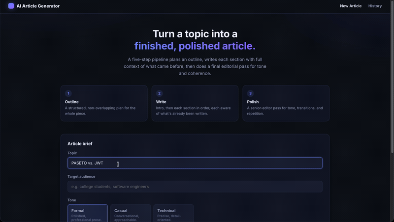

# AI Article Generator

Turns a topic, tone, and target audience into a complete, structured, polished
article -- using a five-step LangChain pipeline instead of one giant
completion, so the result reads like a planned piece of writing rather than a
single unstructured wall of text.

<p>
  
  
</p>

---

## What it does

1. **Outline** -- GPT plans a title, intro, 3-5 non-overlapping body sections, and a conclusion as structured data (not prose), so the shape of the article is decided before any of it is written.
2. **Write** -- the introduction is written first, then each section in order, each one given everything written before it as context so later sections don't repeat earlier ones.
3. **Polish** -- a final editorial pass smooths transitions, enforces one consistent tone, and removes repetition across the whole draft.
4. **Read & export** -- the finished article renders in a clean reading view with a table of contents, and downloads as Markdown or a real `.docx` (proper headings, nested bold/italic, tables, code blocks, and clickable hyperlinks -- not just plain text dumped into a Word file).

You watch real progress as it happens -- "Writing section 2 of 4: ..." -- because each step is a separate, visible call, not one opaque black box.

---
## Demo

Type your topic, select target audience, word count, then click on generate article.



The whole article with sections, and downloadable in word & .txt formats. 


---

## Quickstart

```bash
python3 -m venv .venv

source .venv/bin/activate

python3 app.py
```

Open **http://127.0.0.1:5050** (not 5000 -- see Troubleshooting). The first
run seeds one hand-written sample article into your history, so click **"View
a Sample Article Instead"** to see the reading view and exports immediately,
no API key needed.

To generate real articles, add your key to `.env`:

---

### Getting an OpenAI API key

1. Sign up / log in at **https://platform.openai.com**.
2. Go to **https://platform.openai.com/api-keys** → "Create new secret key".
3. Copy it into `OPENAI_API_KEY` in `.env`.
4. You'll need billing set up on the account (Settings → Billing) -- article generation isn't available on OpenAI's free tier. Costs are small: a ~900-word article with `gpt-4o-mini` (the default) typically costs well under a cent in API usage.

**Never commit `.env` or paste your key anywhere else.** `.gitignore` already excludes it.

---

## Architecture

```
app.py                   Flask routes + background generation worker
backend/
  config.py               .env loading & validation
  llm_chains.py             The 5-step LangChain pipeline (outline/intro/section/conclusion/polish)
  export.py                  Markdown -> DOCX via a real markdown-it-py token walk
  store.py                    JSON-file article persistence (no DB needed)
templates/                Jinja2 pages (setup, generating, article, history)
static/                  CSS + vanilla JS (marked.js via CDN for the reading view)
scripts/seed_demo_data.py   Seeds one sample article from tests/fixtures/
tests/                   pytest suite
```

**Progress, for real**: unlike a single blocking API call, this pipeline runs
in a background thread and reports its *actual* current step ("Writing
section 2 of 4: Why the Cloud Stopped Being Enough") to the browser via
polling -- not a fake animated spinner standing in for one opaque call.
---

## Running tests

```bash
source .venv/bin/activate
pytest -v
```

Fully offline -- the OpenAI client is mocked throughout, and the DOCX export
tests round-trip real Markdown through the converter and inspect the
resulting document structure (paragraph styles, table cells, hyperlink XML),
not just "did it crash.

---
